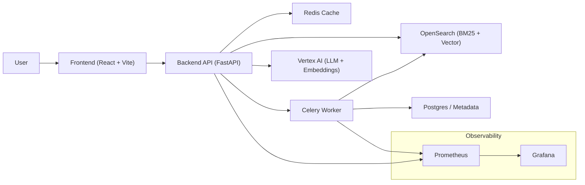

# ai-rag-platform


## 🧩 Architecture Diagram




# AI RAG Platform 

A scalable Retrieval-Augmented Generation (RAG) system designed for **high-performance, low-latency, and cost-efficient AI applications**.

This project demonstrates a **microservices-based architecture** with hybrid retrieval, async processing, and observability.

---

## 🚀 Overview

This platform enables users to upload documents and query them using natural language while ensuring:

* Accurate responses grounded in source data
* Reduced hallucinations using hybrid retrieval
* Optimized latency and cost using caching and async pipelines

---

## 🏗️ Architecture

The system is composed of three major layers:

### 1. Backend (`app/`)

* FastAPI-based APIs
* Handles document ingestion, retrieval, and answer generation
* Integrates with OpenSearch, Redis, and Vertex AI

### 2. Frontend (`ui/`)

* React + Vite UI
* Allows users to upload documents and query the system

### 3. Observability (`observability/`)

* Prometheus + Grafana setup
* Tracks latency, API usage, and system health

---

## 🔄 System Flow

1. User uploads document via UI

2. Backend processes document asynchronously

3. Text is split into chunks

4. Embeddings are generated (Vertex AI)

5. Chunks stored in OpenSearch

6. User submits query

7. System performs:

   * Hybrid search (BM25 + vector search)
   * Retrieves top-K relevant chunks
   * Applies reranking

8. LLM generates final answer based on context

---

## ⚙️ Tech Stack

**Backend**

* Python
* FastAPI
* OpenSearch (BM25 + KNN)
* Redis (caching)
* Vertex AI (LLM + embeddings)
* Celery (async processing)

**Frontend**

* React
* Vite

**Infra & Observability**

* Docker Compose
* Prometheus
* Grafana

---

## 📂 Project Structure

```plaintext
ai-rag-platform/
├── app/               # Backend APIs and RAG logic
├── ui/                # React frontend
├── observability/     # Monitoring (Prometheus, Grafana)
├── docker-compose.yml # Full system orchestration
├── README.md
```

---

## 🧪 How to Run

### 1. Start the system

```bash
docker-compose up --build
```

---

### 2. Access services

* Frontend → http://localhost:5173
* Backend API → http://localhost:8000
* OpenSearch → http://localhost:9200
* Grafana → http://localhost:3000

---

## 📊 Key Features

* Hybrid retrieval (keyword + semantic search)
* Context-aware answer generation
* Redis caching for performance optimization
* Async ingestion pipeline (Celery)
* Observability with Prometheus and Grafana

---

## 🧠 Design Decisions

* **OpenSearch instead of vector DB** → Enables hybrid search + cost efficiency
* **Redis caching** → Reduces latency and LLM cost
* **Async ingestion** → Prevents blocking API requests
* **Hybrid retrieval** → Improves relevance and reduces hallucinations

---

## 🔮 Future Improvements

* Add reranking model (cross-encoder)
* Streaming responses
* Multi-document conversational memory
* Kubernetes deployment

---

## 👨‍💻 Author

**Srinivas Tantravahi**
Senior AI Architect | GenAI Systems | Cloud-Native Engineering

---

📌 API Examples

Below are sample API requests to interact with the RAG system.

🔹 Upload Document
curl -X POST "http://localhost:8000/upload" \
  -F "file=@sample.pdf"

Response:

{
  "success": true,
  "document_id": 1,
  "message": "File uploaded and queued for processing"
}
🔹 Query Documents (Hybrid Search)
curl -X POST "http://localhost:8000/query" \
  -H "Content-Type: application/json" \
  -d '{
    "query": "What is the summary of the document?",
    "k": 5
  }'

Response:

{
  "results": [
    {
      "content": "Sample chunk text...",
      "score": 0.89,
      "metadata": {
        "page": 2,
        "document_id": 1
      }
    }
  ]
}
🔹 Generate Answer


file upload


Documents in the dropdown 


Chat interface 


Same question : 

REtrival from cache /


